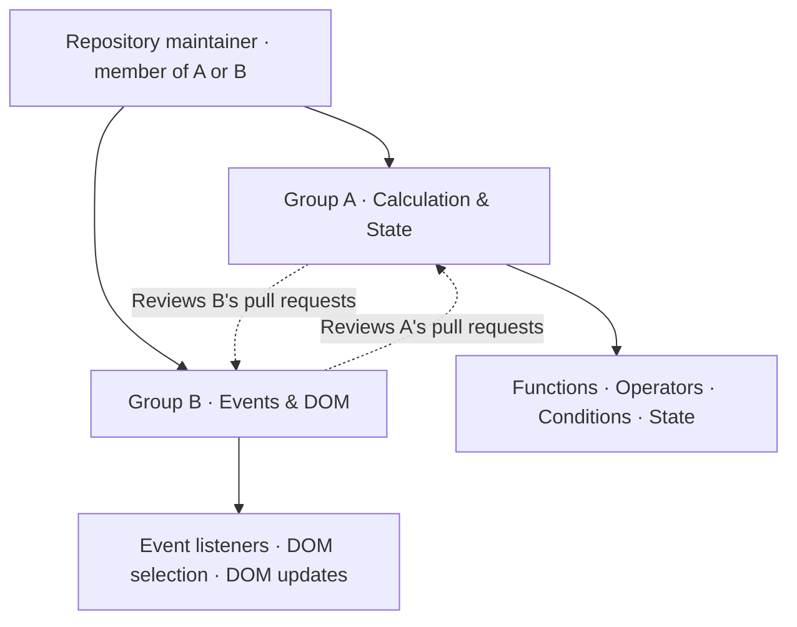
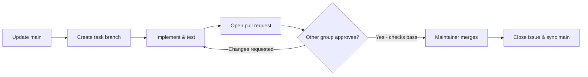

# Smart Calculator — Team Collaboration Guide

> **PS-JS-P01** · JavaScript learning project for every member · Two groups · One shared repository
>
> **Start here:** Assign members → Set up the repository → Claim a task → Create a branch → Open a PR → Review → Merge → Verify deployment.

| Team size | Contribution unit | Review rule | Stable branch |
| --- | --- | --- | --- |
| **1+ members per group** | One issue + one task branch | Other group reviews | `main` |

> [!NOTE]
> **Primary goal: every member learns JavaScript.** HTML and CSS are prerequisites and the existing interface is the shared starting point. Every member must write JavaScript, test it, review another member's JavaScript and explain how it works. Styling or documentation alone does not complete a member's contribution.
>
> The existing calculator is a reference. Trace it first; use focused improvements, fixes and learning exercises to demonstrate understanding. Do not delete working code or replace it wholesale for practice.

## Navigate this guide

| Plan the work | Deliver the work | Finish together |
| --- | --- | --- |
| [01 · Team & ownership](#1-assign-the-team) | [06 · Branch workflow](#6-create-a-branch-for-each-task) | [09 · Verification](#9-shared-verification-checklist) |
| [02 · Repository setup](#2-set-up-the-shared-repository-once) | [07 · Issue & PR templates](#7-issue-and-pull-request-templates) | [10 · Communication](#10-communication-and-handoff) |
| [03 · Group A tasks](#3-group-a--calculation--state) | [08 · Review & merge](#8-review-synchronize-and-merge) | [11 · Release checklist](#11-release-and-project-defense) |
| [04 · Group B tasks](#4-group-b--events--dom) | [05 · Integration contract](#5-agree-on-the-integration-contract) | |

---

## 1. Assign the team

Replace the placeholders before starting. Every issue has one accountable owner, even when several members collaborate.



| Group | Members (GitHub usernames) | Group lead | Main responsibility |
| --- | --- | --- | --- |
| A — Calculation & State | `@member-a1`, add more if needed | `@member-a1` | Calculation functions, input validation and state transitions |
| B — Events & DOM | `@member-b1`, add more if needed | `@member-b1` | Button/keyboard events, rendering, history and integration |

**Repository maintainer:** `@assign-maintainer` (a member of either group). The maintainer handles repository setup, approved merges, and release coordination. This is a responsibility, not a third group.

With one member per group, each member completes their group's tasks and reviews the other group's pull requests. With more members, divide issues among them; give each member their own task branch. Do not have multiple people independently push to the same branch.

## 2. Set up the shared repository once

**Owner: repository maintainer · Complete once before assigning implementation work.**

- [ ] Create one GitHub repository and upload the existing project as the baseline on `main`. If the local `.git` folder was deleted, initialize a repository before the first push; do not initialize again inside an existing repository.
- [ ] Invite both groups as collaborators with the appropriate contribution access.
- [ ] Keep `main` as the stable default branch. All subsequent changes go through pull requests.
- [ ] Configure protection/rules for `main`, where available: require a pull request, at least one approval from someone other than the author, resolved review conversations, and no force pushes or branch deletion. If these controls are unavailable, follow the same rules manually.
- [ ] Create labels: `group-a`, `group-b`, `bug`, `documentation`, `testing`, and `blocked`.
- [ ] Create a board with **Backlog → Ready → In progress → In review → Done**. A blocked issue stays open with the `blocked` label and a comment explaining its dependency.
- [ ] Create the issues listed below, record their actual GitHub numbers, and assign owners and reviewers.

Never commit passwords, tokens, private credentials, or unrelated files. `.git` is local Git metadata, not a project file to upload manually. `.openai` is only relevant if the team chooses to continue the previously registered Sites deployment; it is not required to run this calculator.

## 3. Group A — Calculation & State

**Primary JavaScript:** `applyOperation`, `evaluateExpression`, `createState`, `currentNumber`, `handleInput` in `js/app.js`  
**Also contributes:** Relevant cases in `tests/calculator.test.js`  
**Reviewed by:** Group B

| ID | JavaScript task | Branch suffix |
| --- | --- | --- |
| **A1** | Trace and improve reusable arithmetic functions | `arithmetic-functions` |
| **A2** | Implement or improve number/operator/decimal validation | `input-validation` |
| **A3** | Verify reset, delete, signs and result continuation | `state-transitions` |
| **A4** | Handle invalid expressions and zero division; add regression cases | `calculation-errors` |

### Group A — acceptance checklist

- [ ] **A1:** Explain parameters, return values, arithmetic operators and operation selection. Verify all four operations, precedence and left-to-right evaluation; do not use `eval` or `Function`.
- [ ] **A2:** Use conditions to prevent repeated decimals and misplaced operators. Explain each rule with valid and invalid examples; test input limits.
- [ ] **A3:** Explain how state variables change before and after each action. Verify clear, delete, sign changes, starting fresh and continuing from a result.
- [ ] **A4:** Show how errors are thrown/caught and kept separate from display code. Test incomplete expressions, division by zero and successful correction after an error.

**Work split:** One member owns A1–A4 when working alone. With more members, assign function-level issues and tests to each member. Sequence edits to overlapping functions. Every member must write JavaScript; testing and documentation support that work.

**Learning handoff:** Explain the calculation-to-state flow to Group B using one normal calculation and one error case. Then complete the rotation below.

## 4. Group B — Events & DOM

**Primary JavaScript:** DOM selections, `dispatch`, `render`, `renderHistory`, click and keyboard listeners in `js/app.js`  
**Also contributes:** Integration checks and relevant tests  
**Reviewed by:** Group A

| ID | JavaScript task | Branch suffix |
| --- | --- | --- |
| **B1** | Connect buttons to shared input logic with event listeners | `button-events` |
| **B2** | Select and update expression, result and status elements | `dom-rendering` |
| **B3** | Map keyboard input to the same action path | `keyboard-input` |
| **B4** | Use arrays and DOM creation for history recall/reset | `history-dom` |

### Group B — acceptance checklist

- [ ] **B1:** Explain `addEventListener`, the event object, `target`, `closest` and `dataset`. A button click calls shared logic rather than duplicating calculations inside handlers.
- [ ] **B2:** Explain `querySelector`, `textContent` and `classList`. Render from current state, update errors/results correctly and keep calculations out of rendering functions.
- [ ] **B3:** Explain key mapping, conditions and `preventDefault`. Enter calculates, Escape clears and Backspace deletes; button and keyboard input behave consistently without blocking unrelated shortcuts.
- [ ] **B4:** Explain the history array, iteration, DOM element creation and callback functions. Recalling results and clearing history work. Preserve existing behavior; history is an extension after mandatory features are understood.

**Work split:** One member owns B1–B4 when working alone. With more members, assign event/rendering functions and integration cases to different members. Every member must write JavaScript; no member is assigned only HTML/CSS or screenshots.

**Learning handoff:** Explain the event-to-state-to-DOM flow to Group A. Then complete the rotation below.

### Required rotation — everyone practices both areas

Initial ownership coordinates the first round; it is not a permanent specialization.

| Round | Group A | Group B | Evidence |
| --- | --- | --- | --- |
| **1 · Own your area** | Calculation/state task | Event/DOM task | Focused JavaScript PR + relevant checks |
| **2 · Teach and review** | Explain logic; review B's JavaScript | Explain events/DOM; review A's JavaScript | Review comments and a short walkthrough |
| **3 · Swap areas** | Own a small event/DOM change | Own a small calculation/state change | Second JavaScript PR, reviewed by the original area owner |
| **4 · Demonstrate** | Trace the complete calculator flow | Trace the complete calculator flow | Individual explanation and small live modification |

Choose a real improvement or bug for the swap, such as clarifying an error display, fixing a keyboard edge case or improving a validation function with tests. If no production change is justified, use a clearly labeled practice branch/PR, run and explain the exercise, then close it without merging. Do not introduce artificial changes into `main` just to meet a contribution count.

### Individual JavaScript learning record

Copy one row per member into the team issue. Each person fills in their own evidence; a group lead cannot demonstrate learning on someone else's behalf.

| Member | Calculation/state PR | Event/DOM PR | Test evidence | Cross-group review | Explanation complete |
| --- | --- | --- | --- | --- | --- |
| `@member-a1` | Link | Link | Link | Link | Not yet |
| `@member-b1` | Link | Link | Link | Link | Not yet |

Each member must demonstrate:

- [ ] Variables and state: explain what changes and why.
- [ ] Operators and conditions: explain arithmetic and input decisions.
- [ ] Functions: write a reusable function with parameters and a return value.
- [ ] Events: connect a user action to shared JavaScript logic.
- [ ] DOM: select elements and update their content safely.
- [ ] Debugging: reproduce a problem, inspect values and verify a correction.
- [ ] Collaboration: author a JavaScript change and give a reasoned review.

Pair programming is encouraged. Alternate who types and who reviews; record both roles. Every member still needs an individual code explanation and modification.

## 5. Agree on the integration contract

Both groups must preserve these existing connections unless an issue explicitly changes them:

| Interface contract | Meaning |
| --- | --- |
| `#expression`, `#result`, `#message` | Expression, result and status/error output |
| `.keypad` and its buttons | Delegated button-click handling |
| `data-value="0"` through `"9"`, `"."`, `"+"`, `"-"`, `"*"`, `"/"` | Values passed to the shared input handler |
| `data-action="clear"`, `"delete"`, `"equals"`, `"sign"` | Named calculator actions |
| `#history`, `#clear-history` | History rendering and reset |
| `applyOperation`, `evaluateExpression`, `createState`, `handleInput` | Reusable JavaScript functions exported for tests |

Display symbols may use `×` and `÷`; internal operator values remain `*` and `/`. Group A initially owns calculation/state functions; Group B initially owns event/DOM functions. Both groups edit `js/app.js`, so claim function-level scope in each issue and agree on merge order before overlapping edits. HTML/CSS changes are supporting work only. A contract change needs both groups' agreement and matching HTML/JavaScript updates in the same PR or in a clearly ordered set of dependent PRs.

## 6. Create a branch for each task

Use **`main` → task branch → pull request → `main`**. Separate long-running group branches are unnecessary for this project.



Branch format: `<type>/<group>-<issue-number>-<short-description>`.

Types: `feat`, `fix`, `test`, or `docs`. Examples below use illustrative issue numbers; replace them with the actual issue numbers:

- `feat/group-a-12-input-validation`
- `fix/group-b-18-keyboard-input`
- `test/group-a-21-calculation-errors`
- `docs/group-b-25-release-docs`

<details>
<summary><strong>Step 1 · Clone the repository (once per member)</strong></summary>

Replace `OWNER` and `REPOSITORY` with the shared repository's actual details.

```bash
git clone https://github.com/OWNER/REPOSITORY.git
cd REPOSITORY
```

</details>

<details>
<summary><strong>Step 2 · Update main and create your task branch</strong></summary>

Before each task, start with a clean working tree and update `main`:

```bash
git status
git switch main
git pull --ff-only origin main
git switch -c feat/group-a-12-input-validation
```

</details>

<details>
<summary><strong>Step 3 · Review, commit and push your changes</strong></summary>

Make a focused change, review it, and stage only the intended files. For example, for an input-validation task:

```bash
git diff
git add js/app.js tests/calculator.test.js
git diff --cached
git commit -m "Improve decimal input validation and regression coverage"
git push -u origin feat/group-a-12-input-validation
```

</details>

Use your own branch and file paths for other tasks. Open a PR targeting `main`; open it as a draft when you want early feedback. Do not push unfinished work to `main` or include unrelated cleanup in a feature PR.

## 7. Issue and pull-request templates

<details>
<summary><strong>Copy template · GitHub issue</strong></summary>

Copy this into each issue and fill in the placeholders:

```markdown
## Task
Task ID: A2
Owner: @username
Reviewer: @other-group-member
Branch: feat/group-a-<actual-issue-number>-input-validation

## Goal
Describe the observable improvement or problem.

## JavaScript learning objective
Concepts practiced:
Functions or event handlers owned:
How the owner will demonstrate understanding:

## Scope
- Files expected to change:
- Dependencies / related issues:

## Acceptance criteria
- [ ] Specific, verifiable outcome
- [ ] Relevant checks completed

## Evidence
Steps, results, screenshots where useful, and remaining blockers.
```

</details>

<details>
<summary><strong>Copy template · Pull request</strong></summary>

Copy this into each pull request:

```markdown
## What changed and why
Describe the problem and resulting behavior.

Closes #<actual-issue-number>

## JavaScript explanation
- Concepts practiced:
- Input → function/state change → output:
- One edge case and why the code handles it:

## Validation
- Commands run and results:
- Manual steps and expected/actual results:
- Desktop/mobile screenshots (for visual changes):

## Review checklist
- [ ] Scope matches the linked issue
- [ ] Existing behavior and DOM contract are preserved or deliberately updated
- [ ] Relevant automated and manual checks pass
- [ ] Documentation updated where behavior changed
- [ ] No credentials, unrelated files or debug code
- [ ] Reviewer from the other group requested

## Known limitations
List remaining limitations, or write "None identified".
```

</details>

## 8. Review, synchronize and merge

1. Author checks their own diff and supplies evidence before marking the PR ready.
2. A member of the other group reviews the code and runs the relevant checks. They explain requested changes with a concrete reason, not just "change this".
3. Author addresses comments on the same branch and pushes follow-up commits. Reviewer verifies the changes. Approval must apply to the latest meaningful revision.
4. If `main` changed, update the task branch with a clean working tree:

```bash
git fetch origin
git merge origin/main
```

5. For conflicts, discuss intended behavior with the other file owner. Edit the conflicting files, remove conflict markers, stage the resolved files, and commit. Do not blindly accept all changes from either side. Use `git merge --abort` if the merge needs to be stopped and reconsidered.
6. Run relevant checks again after conflict resolution. Update the PR with the results and request another review when behavior changed.
7. The maintainer merges only approved, passing PRs. Use squash merge for a clear task-level history; preserve co-author credit when members paired on the implementation.
8. Confirm the linked issue is closed, move it to Done, and delete the merged remote branch. Members update their local `main` before starting the next task. Local task-branch deletion is optional; avoid forced deletion if Git reports unmerged work.

Never force-push shared branches. Do not delete another member's work to resolve a conflict. If a merged change breaks `main`, notify both groups and create a focused fix or revert PR promptly.

## 9. Shared verification checklist

Run automated checks after changes to JavaScript or tests, and before release:

```bash
node --test tests/calculator.test.js
```

Run locally by opening `index.html`, or use:

```bash
python -m http.server 8000
```

Then open `http://localhost:8000`. Node.js 18+ is required for the test command; Python is only needed for the optional local server.

| Check | Expected result |
| --- | --- |
| `12.5 * 2`, calculate | `25` |
| `2 + 3 * 4`, calculate | `14` |
| `10 - 3 - 2`, calculate | `5` |
| `0.1 + 0.2`, calculate | `0.3` |
| `1 / 0`, calculate | Useful error message; application stays usable |
| After zero-division error, delete `0`, enter `2`, calculate | `0.5` |
| Enter two decimal points in one operand | Second decimal is rejected |
| Enter `2`, `+`, `*`, `3`, calculate | Extra operator ignored; result `5` |
| Calculate an expression ending in an operator | Useful incomplete-expression message |
| Clear / delete | Reset state / remove latest character |
| Calculate `2 + 3`, then `* 4`, calculate | `20` |
| Type a digit after a completed calculation | Starts a new expression |
| Buttons versus keyboard | Equivalent behavior for supported input |
| Tab, Space, Enter, Escape, Backspace | Accessible focus/activation and documented shortcuts |
| History recall and reset | Result reusable; history can be cleared |
| Mobile widths and long values | Readable controls and no horizontal page overflow |

Record failures as issues with reproduction steps, expected behavior and actual behavior. Do not mark an issue Done merely because code was pushed.

## 10. Communication and handoff

- Before working, claim an issue and move it to In progress. Comment which files you expect to change.
- Post a short update each working day: **Completed / Next / Blocked**. Link the issue or PR.
- If two tasks touch the same file, agree on merge order before editing. Keep unrelated work in separate PRs.
- Put decisions in issue/PR comments so absent members can follow them. Chat alone is not the project record.
- If blocked, tag the member who can help and explain what decision or dependency is needed.
- Before handing work to another member, push the branch and leave a note with completed work, remaining steps, checks run and known problems.

## 11. Release and project defense

Choose a release coordinator from either group. Both groups verify calculation, event and DOM behavior on the deployed site; documentation and deployment duties are shared supporting tasks. The maintainer authorizes and performs the final merge/deployment according to the chosen hosting setup.

- [ ] Both groups' tasks are completed or explicitly deferred with reasons.
- [ ] All mandatory project features pass the shared checks.
- [ ] Latest `main` passes automated tests.
- [ ] Both groups have reviewed each other's work.
- [ ] README describes the actual implementation and setup.
- [ ] Hosting provider and intended audience are agreed upon.
- [ ] Deployment succeeds and its real URL is recorded in README.
- [ ] Both groups test the deployed calculator, not only localhost.
- [ ] Any deployment blocker is recorded honestly; registration alone is not deployment.
- [ ] Every member has completed both calculation/state and event/DOM practice, with linked evidence.
- [ ] Every member has written JavaScript, checked behavior and reviewed another member's JavaScript.
- [ ] Every member can trace button/keyboard input → dispatch → state/calculation → render.
- [ ] Each member can explain their changes and demonstrate a small JavaScript modification without relying on a teammate.

> [!NOTE]
> **Deployment handoff:** The local calculator already exists. A previous Sites registration was not published because its publishing script was unavailable. Confirm current hosting configuration before release; choose an agreed alternative if necessary. Deployment is complete only after a working hosted URL is verified.

Every member should be able to explain operation selection, reusable functions, invalid-input protection, DOM updates, event listeners, keyboard mapping and zero-division handling. Each group should walk the other through its implementation before the final demonstration.

---

[Back to top](#smart-calculator--team-collaboration-guide)
